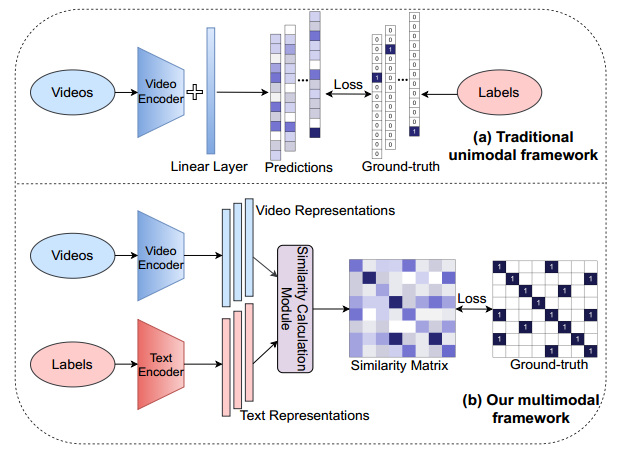

# This is an official pytorch implementation of ActionCLIP: A New Paradigm for Video Action Recognition [[arXiv]](https://arxiv.org/abs/2109.08472)

## Updates
 - 2022.01: Add the trained model download link of [google driver](https://drive.google.com/drive/folders/1qs5SzQIl__qo2x9h0YudpGzHhNnPGqK6?usp=sharing).

## Overview




## Content 
 - [Prerequisites](#prerequisites)
- [Data Preparation](#data-preparation)
- [Uodates](#updates)
- [Pretrained Models](#pretrained-models)
  * [Kinetics-400](#kinetics-400)
  * [Hmdb51 && UCF101](#HMDB51&&UCF101)
- [Testing](#testing)
- [Training](#training)
- [Contributors](#Contributors)
- [Citing_ActionClip](#Citing_ActionCLIP)
- [Acknowledgments](#Acknowledgments)

## Prerequisites

The code is built with following libraries:

- [PyTorch](https://pytorch.org/) >= 1.8
- [wandb](https://wandb.ai/)
- RandAugment
- pprint
- tqdm
- dotmap
- yaml
- csv

For video data pre-processing, you may need [ffmpeg](https://www.ffmpeg.org/).

More detail information about libraries see [INSTALL.md](INSTALL.md).

## Data Preparation
We need to first extract videos into frames for fast reading. Please refer to [TSN](https://github.com/yjxiong/temporal-segment-networks) repo for the detailed guide of data pre-processing.
We have successfully trained on [Kinetics](https://deepmind.com/research/open-source/open-source-datasets/kinetics/), [UCF101](http://crcv.ucf.edu/data/UCF101.php), [HMDB51](http://serre-lab.clps.brown.edu/resource/hmdb-a-large-human-motion-database/),
[Charades](https://prior.allenai.org/projects/charades). 
 
## Updates
- We now support single crop validation(including zero-shot) on Kinetics-400, UCF101 and HMDB51. The pretrained models see [MODEL_ZOO.md](MODEL_ZOO.md) for more information.
- we now support the model-training on Kinetics-400, UCF101 and HMDB51 on 8, 16 and 32 frames. The model-training configs see [configs/README.md](configs/README.md) for more information.
- We now support the model-training on your own datasets. The detail information see  [configs/README.md](configs/README.md).

## Pretrained Models
Training video models is computationally expensive. Here we provide some of the pretrained models.
We provide a large set of trained models in the ActionCLIP [MODEL_ZOO.md](MODEL_ZOO.md).

### Kinetics-400
We experiment ActionCLIP with different backbones(we choose Transf as our final visual
prompt since it obtains the best results) and input frames configurations on k400. Here is a list of pre-trained models that we provide (see Table 6 of the paper).
*Note that we show the 8-frame ViT-B/32 training log file in [ViT32_8F_K400.log](logs/ViT32_8F_K400.log).


 | model             | n-frame     | top1 Acc(single-crop) | top5 Acc(single-crop)| checkpoint                                                   |
| :-----------------: | :-----------: | :-------------: |:-------------: |:---------------------------------------------------------: | 
|ViT-B/32 | 8 | 78.36%          | 94.25%|[link](https://pan.baidu.com/s/1NOKtVG6wxCrKvZ12IAofSQ) pwd:b5ni 
| ViT-B/16  | 8 |   81.09%    | 95.49% |[link](https://pan.baidu.com/s/1alr0JNF5sdcU3jtCpT0Bow) pwd:hqtv
| ViT-B/16 | 16 | 81.68%  | 95.87% |[link](https://pan.baidu.com/s/1iWpuUzML3gfxq-4KrwIO5A) pwd:dk4r
| ViT-B/16 | 32 |82.32%    | 96.20% |[link](https://pan.baidu.com/s/1hnmFQcoe6ii_mU7BzeTL5Q) pwd:35uu                                                      


### HMDB51 && UCF101
On HMDB51 and UCF101 datasets, the accuracy(k400 pretrained) is reported under the accurate setting.

#### HMDB51
| model             | n-frame     | top1 Acc(single-crop) | checkpoint                                                   |
| :-----------------: | :-----------: | :-------------: |:---------------------------------------------------------: | 
|ViT-B/16 | 32 | 76.2%          | [link]() 

#### UCF101
| model             | n-frame     | top1 Acc(single-crop) | checkpoint                                                   |
| :-----------------: | :-----------: | :-------------: |:---------------------------------------------------------: | 
|ViT-B/16 | 32 | 97.1%          | [link]() 

## Testing 
To test the downloaded pretrained models on Kinetics or HMDB51 or UCF101, you can run `scripts/run_test.sh`. For example:
```
# test
bash scripts/run_test.sh  ./configs/k400/k400_test.yaml

```
### Zero-shot
We provide several examples to do zero-shot validation on kinetics-400, UCF101 and HMDB51.
- To do zero-shot validation on Kinetics from CLIP pretrained models, you can run:
```
# zero-shot
bash scripts/run_test.sh  ./configs/k400/k400_ft_zero_shot.yaml
```
- To do zero-shot validation on UCF101 and HMDB51 from Kinetics pretrained models, you need first prepare the k400 pretrained model and then you can run:
```
# zero-shot
bash scripts/run_test.sh  ./configs/hmdb51/hmdb_ft_zero_shot.yaml

```


## Training
We provided several examples to train ActionCLIP  with this repo:
- To train on Kinetics from CLIP pretrained models, you can run:
```
# train 
bash scripts/run_train.sh  ./configs/k400/k400_train.yaml
```
- To train on HMDB51 from Kinetics400 pretrained models, you can run:
```
# train 
bash scripts/run_train.sh  ./configs/hmdb51/hmdb_train.yaml
```
- To train on UCF101 from Kinetics400 pretrained models, you can run:
```
# train 
bash scripts/run_train.sh  ./configs/ucf101/ucf_train.yaml
```
More training details, you can find in  [configs/README.md](configs/README.md)

## Contributors
ActionCLIP is written and maintained by [Mengmeng Wang](https://sallymmx.github.io/) and [Jiazheng Xing](https://april.zju.edu.cn/team/jiazheng-xing/).

## Citing ActionCLIP
If you find ActionClip useful in your research, please cite our paper.

# Acknowledgments
Our code is based on [CLIP](https://github.com/openai/CLIP) and [STM](https://openaccess.thecvf.com/content_ICCV_2019/papers/Jiang_STM_SpatioTemporal_and_Motion_Encoding_for_Action_Recognition_ICCV_2019_paper.pdf).
